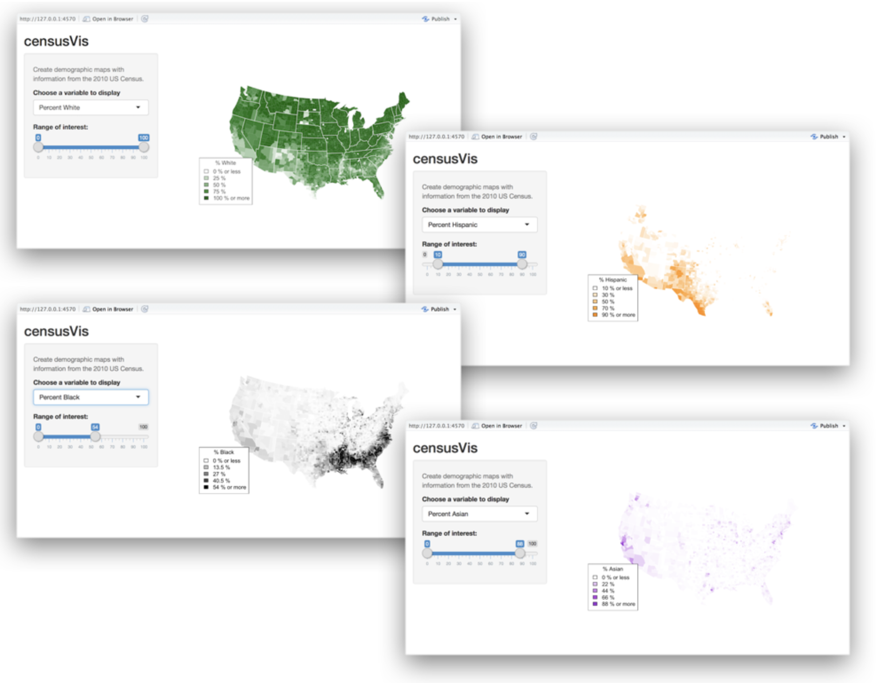

# CensusApp is aimed to build a sophisticated app that visualizes US Census data.

#### Related files are included helper.R (https://shiny.rstudio.com/tutorial/written-tutorial/lesson5/census-app/helpers.R) and counties.rds (https://shiny.rstudio.com/tutorial/written-tutorial/lesson5/census-app/data/counties.rds)
